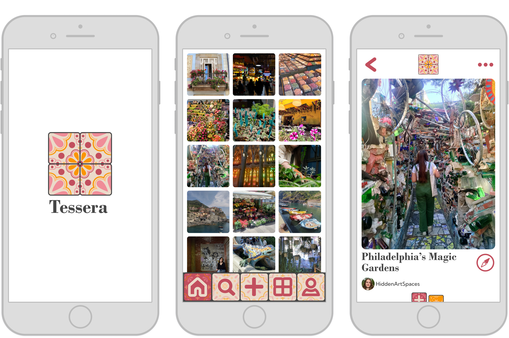
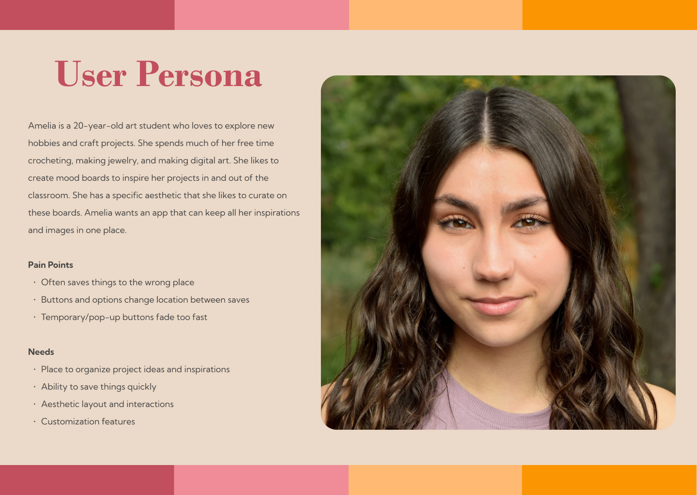
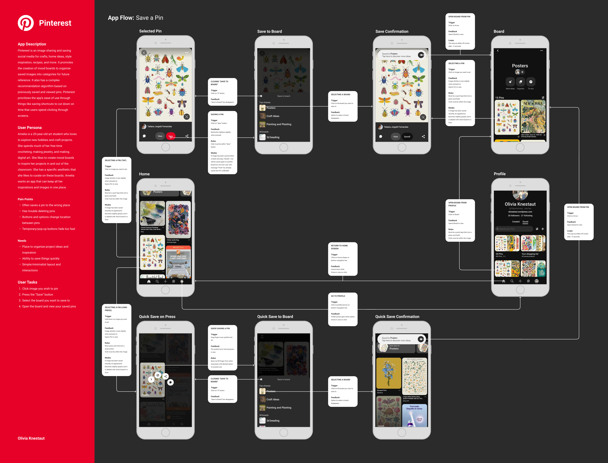
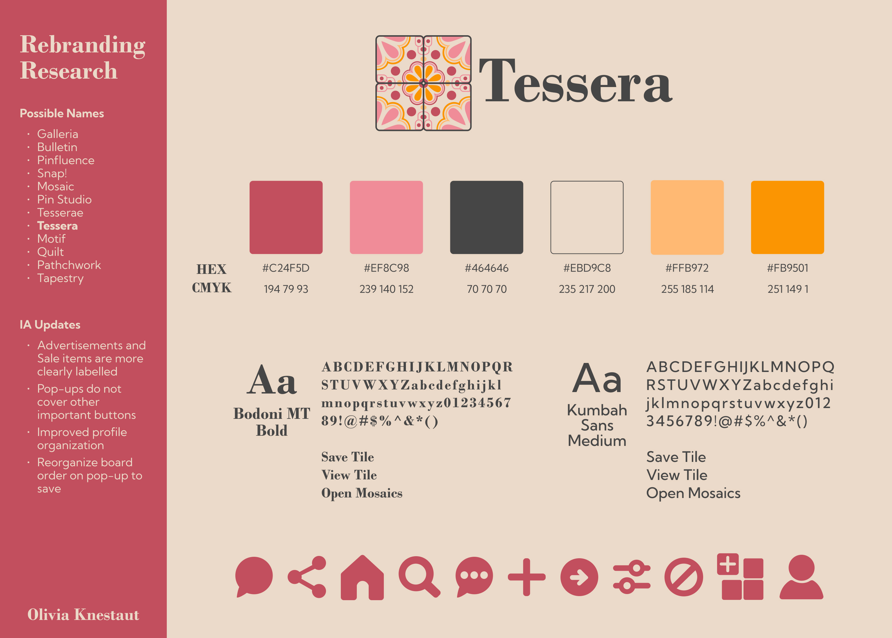
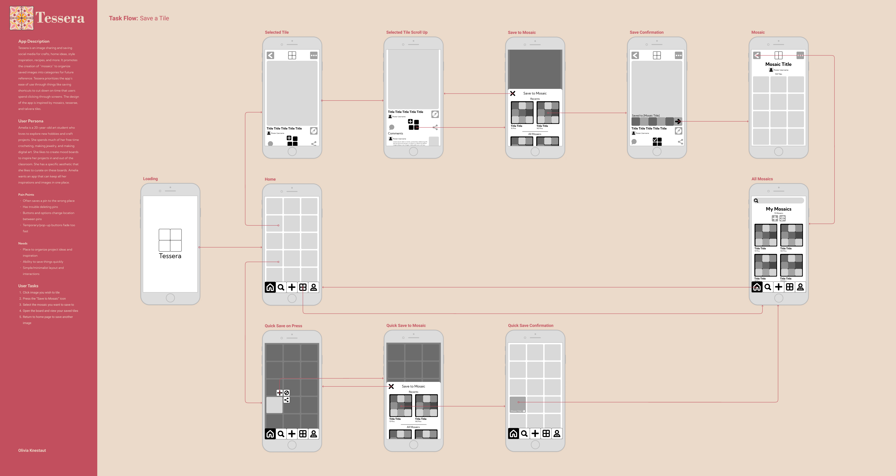
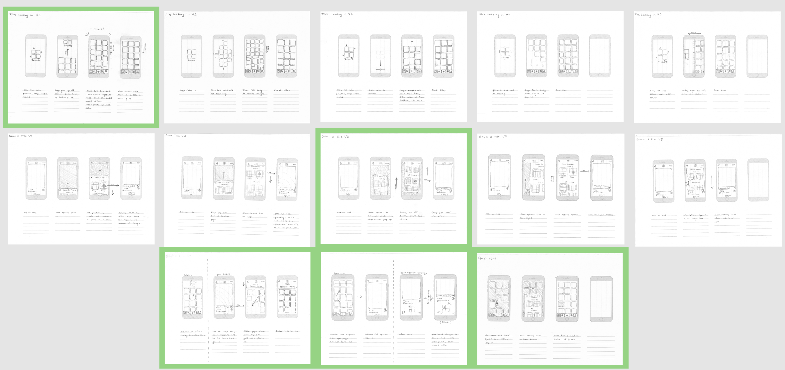

# Tessera

### Navigation
- [Home](Home_Content.md)
    - [Case Studies](CaseStudies_Content.md)
        - [Tessera](CS1_Tessera_Content.md)
        - [Riverfront Wilmington](CS2_RiverfrontWilm_Content.md)
        - [Best Fronds](CS3_BestFronds_Content.md)
    - [Design & Media](DesignAndMedia_Content.md)
    - [Photography](Photography_Content.md)
- [About](About_Content.md)
- [Resume](Resume_Content.md)

# Tessera, Interaction Design

### Table of Contents

1. [Overview](#overview)
2. [Users & Audience](#users--audience)
3. [Roles & Responsibilities](#roles--responsibilities)
4. [Design Process](#design-process)
5. [Results](#results)

## Overview

This project is interaction design for the fictional Pinterest-like app Tessera created for the class IDM 213, Interaction Design, under the direction of Professor and Program Head Troy Finamore. Working individually, but with class and instructor support, we were tasked to redesign an app and prototype new interactions for the main task flow using After Effects and Figma. Over 10+ weeks I brainstormed, wireframed, designed, and animated to develop my final After Effects prototype.

## Users & Audience

The primary audience of this app is creative young adults. I created the following user persona to represent this.

## Roles & Responsibilities

This was an independent project. I completed all work over 10+ weeks, however I did receive constructive feedback from my peers and instructors. As a class, I had weekly meetings with my professor to receive feedback on my progress.

## Design Process

### Current Pinterest App Flow

My app is inspired by Pinterest so to begin I analyzed the current flow of user tasks to save a pin. I evaluated both the longer click through path as well as the press and hold short cut path.

### Rebranding Research

On Pinterest, the gimmick is pins on a bulletin board, so I changed my app to reference tiles in a mosaic. I wanted to work with a color scheme I had not used before, so I chose a pink and orange scheme that is friendly and relaxing. I chose the serif font Bodoni MT Bold for my headers because it felt traditional and formal to match the tile logos and designs. I chose the sans serif font Kumbah Sans Medium for the body text for legibility of smaller text blocks on the app. The design of the app overall is inspired by mosaics, tesserae, and Talvera tiles.

### Interface Sketches

These initial sketches informed the redesign of the app’s primary pages. Those marked with green stars were chosen and referenced in the wireframe and high-fidelity designs.

### Wireflow

My wireframes in the task flow paths begin to establish the concept of my animation plans. This plan does end up being cut down further and the “My Mosaics” page is not included.

### IX Flow

Filling in the flow with the high-fidelity designs maps out the key points for the animation. This screen will be the starting and ending keyframes of my After Effects compositions.

### Interaction Sketches

I sketched 5 different ideas for my two main animations, tiles loading in and saving a tile. I also made a few options for smaller micro-interactions I wanted to include. The sketches surrounded by green were the ones I chose to inspire my final animations.

### Interaction Guides

The interaction guides use my high-fidelity designs to block out the important keyframes to clarify the animation plans. These frames were sent from Figma into After Effects using the AEUX extension to begin the animation process.

## Results

The final product is a ~30-second animation stepping through the primary task flow of saving a tile on a mobile device.

[Final Animation](https://www.youtube.com/watch?v=JhCf8rV7N_w)