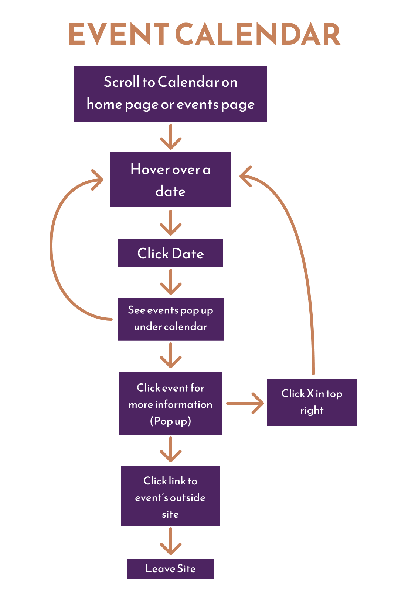

# Riverfront Wilmington

### Navigation
- [Home](Home_Content.md)
    - [Case Studies](CaseStudies_Content.md)
        - [Tessera](CS1_Tessera_Content.md)
        - [Riverfront Wilmington](CS2_RiverfrontWilm_Content.md)
        - [Best Fronds](CS3_BestFronds_Content.md)
    - [Design & Media](DesignAndMedia_Content.md)
    - [Photography](Photography_Content.md)
- [About](About_Content.md)
- [Resume](Resume_Content.md)

# Riverfront Wilmington, Interactive Website Redesign

### Table of Contents

1. [Overview](#overview)
2. [Problem Statement](#problem-statement)
3. [Users & Audience](#users--audience)
4. [Roles & Responsibilities](#roles--responsibilities)
5. [Design Process](#design-process)
6. [Results](#results)

### [Desktop Prototype](https://www.figma.com/proto/cZHQf3yTBglO7nfdYxfKpl/Final-Project?page-id=1%3A2&node-id=6-22&viewport=760%2C241%2C0.06&scaling=scale-down&starting-point-node-id=6%3A3698)

### [Mobile Prototype](https://www.figma.com/proto/cZHQf3yTBglO7nfdYxfKpl/Final-Project?page-id=1%3A3&node-id=6-4218&viewport=830%2C578%2C0.13&scaling=scale-down&starting-point-node-id=6%3A5473)

## Overview

This project is an adaptive and interactive redesign of the Riverfront Wilmington website created for the classes IDM 211 & 212, user interface design I & II, under the direction of Professor Antonia Brown. working individually, but with class and instructor support, we were tasked to redesign and prototype a website of our choosing to exemplify interface design principles and usability heuristics. over 20+ weeks I researched, brainstormed, wireframed, designed, and prototyped to develop my final desktop and mobile Figma designs.

## Problem Statement

The Riverfront Wilmington website is in need of reworking because the current website (https://riverfrontwilm.com/) is difficult to navigate, poorly designed, and not adaptive so I will design and prototype a new site to fit modern standards and cater to the website’s audience.

## Users & Audience

the audience of this website covers a wide range, so I created 3 user personas to base my solutions around. these three personas are essentially, the local, the worker, and the tourist.

## Roles & Responsibilities

This was an independent project. I completed all work over 20+ weeks, however I did receive constructive feedback from my peers and instructors. as a class, we also did collective brainstorming and I had several friends participate in the user testing of my final sites.

## Design Process

### Improvements Needed

In IDM 211: Interface Design I, we were tasked with selecting a website we thought could use a redesign. I chose the Riverfront Wilmington website, a local boardwalk-type area in my home state. The website was difficult to navigate, poorly designed, and not adaptive. most of the photos on the site did not fit inside their frames properly and the header often covered titles and text. this location is important to me, so I wanted their website to reflect how amazing the Wilmington Riverfront really is.

*Navigation bar does not work correctly, sections are inconsistent in size, covers titles and headers, reorganized pages*

*The site needs to reduce wasted & blank space, include more photos*

*Current calendar on home page is not maintained*

### Mood Boards

After determining some of the main things to focus on improving I began to test font and color pairings. I chose an orange/rust and blue/teal color scheme because I felt it captured the historical and industrial roots of the Wilmington Riverfront as well as the river. for my header and title font I chose Reem Kufi, in all caps, and for my body text, I chose Baskerville. I think the sans-serif and serif fonts have a nice contrast that feels both modern and historical.

### Site Maps and Navigation Reorganization

In order to reorganize the navigation menu I had my peers participate in a card sort activity. I used their input to recategorize the pages and make site maps to inform my website design. Ultimately, I condensed the two previous navigation menus into one navigation bar with five main sections: explore, history, home, about, and events. some pages were combined together, and others resorted under a more relevant navigation item.

### Wireframes and Iteration

After creating ideation sketches, I began to build preliminary wireframes in Figma based on my new navigation. My wireframes went through a variety of iterations before I ever introduced color into the designs. By the end of IDM 211 I has my designs fully built out in color for three pages on both mobile and desktop. In IDM 212 I made a few changes based on the interactions I was introducing, but my designs did not change significantly.

*Early wireframe iterations*

*Color UI home page designs, first design → final*

### Prototyping and Interactions

Moving into IDM 212, I had to take my designs from the previous class and prototype them, with 3 specific and complex components built out. My components were: a sub navigation system based on my initial site map, a weekly event calendar, and an interactive map. I created user flows for these interactions to solidify how each would work in the prototype. I also had to determine which of my personas would aid in completing their primary task. I used component sets to build out each of my main interactions. They were only partially built out, so long as they could be demonstrated to complete my persona’s tasks. I also built out some smaller and more general interactions like buttons and links across the pages.

## Results

The final product has 12 screens fully designed and interactive on both desktop and mobile. The prototypes for sub navigation, event calendar, and interactive map have also been implemented in these designs with changes between them depending on the device.

### [Desktop Prototype](https://www.figma.com/proto/cZHQf3yTBglO7nfdYxfKpl/Final-Project?page-id=1%3A2&node-id=6-22&viewport=760%2C241%2C0.06&scaling=scale-down&starting-point-node-id=6%3A3698)

### [Mobile Prototype](https://www.figma.com/proto/cZHQf3yTBglO7nfdYxfKpl/Final-Project?page-id=1%3A3&node-id=6-4218&viewport=830%2C578%2C0.13&scaling=scale-down&starting-point-node-id=6%3A5473)

*All desktop pages built out in Figma*

*All mobile pages built out in Figma*