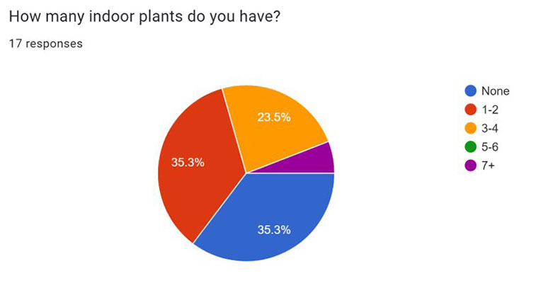

# Best Fronds

### Navigation
- [Home](Home_Content.md)
    - [Case Studies](CaseStudies_Content.md)
        - [Tessera](CS1_Tessera_Content.md)
        - [Riverfront Wilmington](CS2_RiverfrontWilm_Content.md)
        - [Best Fronds](CS3_BestFronds_Content.md)
    - [Design & Media](DesignAndMedia_Content.md)
    - [Photography](Photography_Content.md)
- [About](About_Content.md)
- [Resume](Resume_Content.md)

# Best Fronds, Multimedia Product and App Design

### Table of Contents

1. [Overview](#overview)
2. [Problem Statement](#problem-statement)
3. [Users & Audience](#users--audience)
4. [Roles & Responsibilities](#roles--responsibilities)
5. [Research](#research)
6. [Design Process](#design-process)
7. [Results](#results)

### [Figma Prototype](https://www.figma.com/proto/Q4fB1Ct0SJk214ZKSueVfw/Olivia-Knestaut?page-id=36%3A2&node-id=76%3A2&viewport=332%2C197%2C0.12&scaling=scale-down&starting-point-node-id=76%3A2)

## Overview

Best Fronds is an app and physical product prototype duo created for the class PROD 215: Design Thinking in Production under the direction of Professor Henry Homza. Working with partner Lucia Garzon, we were tasked to develop a multimedia solution to a problem of our choosing. Our final solution is comprised of the Best Fronds Plant Monitoring Pot and the Best Fronds App. Over three weeks we examined our topic through both primary and secondary research, which informed our physical and Figma designs.

## Problem Statement

College students need a device to help them care for indoor plants and cultivate a relationship with nature because they struggle to keep plants alive and reap the mental health benefits of nature.

## Users & Audience

Our target audience age range was 15-25 year old high school and college students. The products were designed with experienced and non-experience plant owners in mind.

## Roles & Responsibilities

### Olivia
- Preliminary Research on mental health benefits on students of maintaining indoor plants.
- Physical prototype sketches
- Symbol and icon design
- Interaction prototyping

### Lucia

- Preliminary Research on the reasons people struggle to care for plants as well as college students relationships with plants
- App screen prototype sketches
- Character design
- Storyboards

### Together

- Primary Research through survey of students at our university
- Affinity Mapping
- App screen designs in Figma
- Physical prototype build
- Presentation design

## Research

### Preliminary Research

After selecting our topic with the goal of supporting college student mental health through nature we began preliminary research to inform our project. I conducted my preliminary research on the mental health benefits of keeping plants. I found that keeping indoor plants helped students in three main areas: Stress, Focus & Performance, and Student Satisfaction. Lucia conducted her preliminary research on plant care struggles and found three main areas as well: Botanical Illiteracy, Insecurity, and Outside Pressure.

#### Stress

Placing small plants chosen by the participants within close sight of them contributed to psychological stress reduction (Toyoda, M., Yokota, Y., Barnes, M., & Kaneko, M., 2020). Indoor plants reduced physiological stress and led to the suppression of stress-associated behaviors in the autonomic nervous system (Lee, M.-S., Lee, J., Park, B.-J., & Miyazaki, Y., 2015).

#### Focus & Performance

“Participants’ task performance was better when they felt more active and confident, and when the object in the room was perceived as calm and not distracting” (Shibata, S., & Suzuki, N., 2004). Plants helped increase the productivity of the participants, who consistently completed the tasks 6% to 12% faster with plants than without (Lohr, V. I., Pearson-Mims, C. H., & Goodwin, G. K., 1996).

#### Student Satisfaction

“Students in the experimental group [who interacted with plants], on average reported higher satisfaction with classes than students in the control group” (Plante, A. D., 2014). Students rated the classes with plants in them better than classes without. “The range of scores was much narrower… minimum and maximum scores being 59 and 100 compared with the control groups… scores of 29 and 100” (Doxey, J. S., Waliczek, T. M., & Zajicek, J. M., 2009).

#### Botanical Illiteracy

There is a lack of focus on plant biology in education system. Many students do not have prior experience with taking care of plants.

#### Insecurity

Illiteracy leads to the belief that students have “no green thumb”. Prior to taking care of a plant for a long period of time, college students part of a study demonstrated fear to start growing plants.

#### Outside Pressure

College students face fatigue from classes. Stress from a more difficult academic workload + adapting to new social environment.

### User Research

We conducted a survey of students at our university to determine students attitudes towards keeping plants, their experiences, struggles, and input on our project ideas. Through our survey we found that 35% of students surveyed kept no plants and 35% kept only 1-2 plants. 70% of students reported “often” or “always” struggling with how much to water their plants and 53% reported “often” or “always” struggling with how much sun their plants needed. This survey also helped us determine a target price range which would impact the materials and technology we would propose. Finally, we received input on the ideas we had as well as new ideas from students.

## Design Process

Based on our preliminary and user research, we determined that we wanted the app to take a personalized approach to plant care. By developing a relationship with your plant will help improve your will to care for it. We planned to create this through the ability to name the plant, see its “emotions”, and understand its needs clearly. Based on these ideas, and input for survey participants we created an affinity map to visualize and sort our plans.

### Affinity Map

### Story Boards

### Final Decisions

After creating a range of ideation sketches we received feedback form our PROD: 215 class and instructor to choose our final direction. We gave priority to features and design ideas that had received the most positive feedback from our class and survey participants. We also chose concepts that could be prototyped in the 2 week time span we had for the rest of the project.

## Results

### Physical Prototype

For the physical product we decided we would like to market it at about $15. In order to do this we chose prospective materials as high density polyethylene (HDPE) plastic, solar panels, copper wiring, and moisture sensors. The product would also be available in a range of colors, designs, and sizes to fit all plant and style needs. The technology in the pot would send data to the app where users can find out how to best care for their plants.

### App Prototype

#### [Figma Prototype](https://www.figma.com/proto/Q4fB1Ct0SJk214ZKSueVfw/Olivia-Knestaut?page-id=36%3A2&node-id=76%3A2&viewport=332%2C197%2C0.12&scaling=scale-down&starting-point-node-id=76%3A2)

